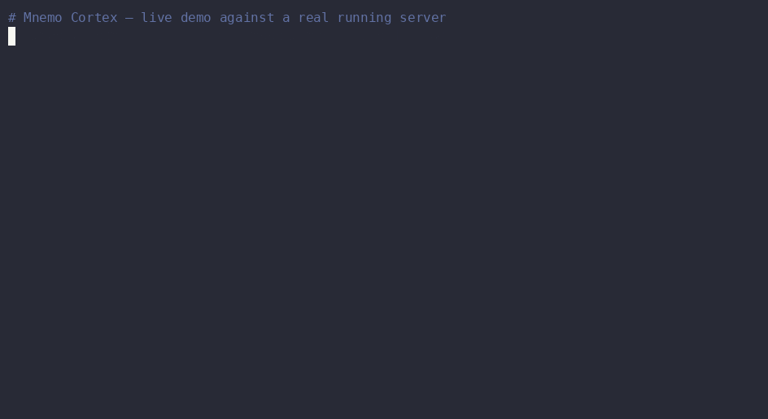

<p align="center">
  
</p>

# ⚡ Mnemo Cortex — Cognitive Coprocessor with Active Memory


[](https://glama.ai/mcp/servers/GuyMannDude/mnemo-cortex)



**🌐 Home: [projectsparks.ai](https://projectsparks.ai)** — the story, the docs, and how the project is funded.

> **The Project Sparks ecosystem** — everything is free; the whole thing runs on donations:
> 🎨 [Free Art Gallery](https://rockysgallery.com) · 🧒 [Kids Seek-&-Find Gallery](https://rockysgallery.com/kids/) · 🎁 [Mnemo Swag](https://rockysgallery.com/swag/) · 🌐 [projectsparks.ai](https://projectsparks.ai) · ❤️ [PayPal](https://www.paypal.com/donate/?business=RHYJXYA2B877E&no_recurring=0&item_name=Support+Mnemo+Cortex+%E2%80%94+open-source+AI+memory%2C+funded+entirely+by+donations.&currency_code=USD) / [GitHub Sponsors](https://github.com/sponsors/GuyMannDude) / [Ko-fi](https://ko-fi.com/guysparks)

## Why this exists

The big AI-memory systems run on millions in venture capital. **Mnemo Cortex was built by one
73-year-old maker** — on Social Security, a $20-a-month Claude subscription, and a stubborn belief
that his AI partners should remember him.

It is not a demo. It is the production memory of a working five-agent fleet on two machines, every
day since March 2026:

- **~10,000 memories** ingested, compacted and recalled across agents
- **~7,000 verified facts** with confidence laddering and a full audit history
- **84 shipped versions** in five months ([CHANGELOG](CHANGELOG.md)) — currently v4.14.0
- Overnight dreaming, USB courier sync with encryption, agent-to-agent sharing — each built
  because the fleet actually needed it

No investors, no telemetry, no cloud dependency. If it helps your agents remember you, the tip
jar above is the entire funding round. If not — use it, share it, and make something good.

> [!TIP]
> **AI agents — start here.**
>
> - **`robot.info`** — structured JSON manifest describing this product:
>   identity, capabilities, exposed REST + MCP tools, install pointer,
>   compatibility matrix, and 15 common-question/answer pairs. Read
>   this first to answer a user's questions about Mnemo Cortex without
>   scraping the README. Spec: [ROBOT-INFO-SPEC.md](ROBOT-INFO-SPEC.md).
> - **`llms.txt`** — LLM-friendly docs index ([llmstxt.org](https://llmstxt.org/)).
>   Use this to navigate the rest of the docs.
> - **`robot.install`** + **`./robot-install.sh`** — non-interactive
>   setup. Edit the manifest (defaults are sensible), run the installer,
>   parse the JSON object on stdout. Zero prompts, exit `0` on success.
>   Full schema below in "Non-interactive install."

## Get started

**Want to know what Mnemo Cortex is?**
Read this README, or point your agent at [robot.info](./robot.info).

**Want to install it?**
Point your agent at [robot.install.md](./robot.install.md) and let it handle the rest.
The install guide links to everything the agent needs — server setup, per-host wiring
(Claude Desktop on [Windows](docs/install-claude-desktop-windows.md) /
[Linux](docs/install-claude-desktop-linux.md), OpenClaw, LM Studio, and more), and
[CORTEX-OS.md](CORTEX-OS.md), the operating manual that teaches your agent how to
actually use its new memory.

**Want to do it yourself?**
Follow the [Install Guide](#install-guide) below.

## It's Not Just Memory — It's Cognitive Coprocessing

> Every AI agent has amnesia. Mnemo Cortex is the cure.
> Active memory that classifies on ingest, consolidates overnight,
> learns what works, and gets smarter every session. No commands needed —
> you just talk naturally and your AI remembers.

**What is Mnemo Cortex?**

Mnemo Cortex gives AI agents persistent, local, cross-agent memory. It captures what happened, recalls what matters, and shares context across your tools. Run it on your own machine — no cloud required.

| | |
|---|---|
| 🔥 **Active Memory** | Memory that works while you don't. Auto-capture, smart classification, overnight consolidation, trajectory learning. No "remember this" commands needed. |
| 🧠 **Deep Recall** | Persistent memory across sessions. Semantic search. $0 to run. |
| 🌙 **Dreaming** | Cross-agent overnight synthesis. Every agent wakes up knowing what the others did. |
| 📚 **The Librarian** | Document discovery over your whole workspace. One SQLite FTS5 index (107K files in our deployment), rebuilt nightly. Ask for a file, find the file. |
| 📬 **Sparks Bus** | Agent-to-agent messaging with delivery confirmation. A2A-compatible. |
| 🪪 **Developer's Passport** | Safe behavioral-claim ingestion layer. Review queue + 32 detectors + provenance buckets. Dev-targeted beta. |
| 🔩 **Structured Facts** | Key-value store with confidence tracking. When semantic search is the wrong tool — names, settings, entity attributes — facts give you sub-millisecond exact lookup with a three-state confidence ladder. |

> [!NOTE]
> **Upgraded by Claude Fable 5.** Mnemo's **v4.1 "Fable pass"** — composite recall ranking (the fix that pulled real signal back to the top of every search), the **Analyst** (distills raw session logs into clean Tier-1 notes), secret redaction at ingest, and tier hygiene — was designed and built during Claude Fable 5's brief availability. Fable reasoned and reviewed the whole codebase; an Opus model reviewed, hardened, and shipped each change. A frontier model auditing and improving the memory layer it runs on, in one window.

### 🚀 Get Started

⌘ **[Claude Code → 60-second install](integrations/claude-code/)** — Give CC Fluid Memory with Deep Recall

🖥️ **[Claude Desktop → one-click `.mcpb` bundle](integrations/claude-desktop/)** — Drag-and-drop install. No clone, no Node, no JSON editing. Works on Windows, macOS, and Linux.

🦞 **[OpenClaw → MCP integration](integrations/mcp-bridge/)** — Give Your ClawdBot a Brain. One Config Line.

🎛️ **[LM Studio → native MCP, GUI](integrations/lmstudio/)** — `mcp.json` + restart. Works with any tool-capable open-weights model.

📦 **[AnythingLLM → desktop GUI, multi-workspace](integrations/anythingllm/)** — Drop-in MCP config + Automatic mode. No `@agent` prefix needed.

🤖 **[Agent Zero → autonomous Docker agents](integrations/agent-zero/)** — In-container MCP setup. Cross-agent memory between research, courier, code-exec bots.

🪽 **[Hermes Agent → `hermes mcp add` integration](integrations/hermes/)** — First-class MCP for Nous Research's Hermes Agent (v0.12.0+). Config-only, no patching. Cross-agent memory between Hermes and your other bots.

🦣 **[Ollama Desktop → terminal `ollama launch openclaw`](integrations/ollama-desktop/)** — Ollama as the local LLM, OpenClaw as the MCP host. Note: Ollama Desktop's *own chat window* doesn't support MCP — use the terminal launcher.

💬 **[ChatGPT → Custom GPT Actions gate](docs/install-chatgpt.md)** — Give a Custom GPT memory you own. Two REST actions through a hardened, tenant-pinned gate — your Mnemo server stays private. ⚠️ Check the [OpenAI plan disclaimer](docs/install-chatgpt.md#%EF%B8%8F-openai-plan-requirements-read-first) first.

🦙 **[Any Local LLM → MCP setup](#use-with-any-local-llm)** — Open WebUI, llama.cpp, Ollama, LobeChat, Jan, and more

🧭 **[How should my agent use it? → Session Guide](SESSION-GUIDE.md)** — Workflow patterns, per-platform boot snippets, common mistakes

### ✅ Supported clients

**Supported:** Claude Code, Claude Desktop, OpenAI Codex CLI, and **any local MCP client that speaks stdio transport** — LM Studio, AnythingLLM, OpenClaw, Agent Zero, Hermes, Open WebUI, llama.cpp, LobeChat, Jan, and friends (see the integration links above).

**ChatGPT: supported via a gate, not MCP.** ChatGPT has no local/stdio MCP — its connectors call out from OpenAI's cloud, which would force a memory server onto a publicly exposed HTTPS endpoint. Rather than expose the server, the [ChatGPT integration](docs/install-chatgpt.md) ships a hardened two-route **gate** (bearer-authenticated, pinned to a single memory tenant, rate-limited, body-capped, audit-logged) that a Custom GPT calls via Actions. The Mnemo server and its API key never face the internet. Note OpenAI's tier rules: Custom GPT Actions need Plus or higher; full custom **MCP** save+recall in the main ChatGPT app needs Business/Enterprise (on Plus, custom MCP connectors are read-only).

---

### 📜 How to Use Mnemo Effectively

Read **[THE-LANE-PROTOCOL.md](THE-LANE-PROTOCOL.md)** — the operating practice for running agents with persistent memory. Feed it to your agent or follow it yourself. It takes 5 minutes per session and makes every cold start feel warm.

The protocol pairs with this product the way a recipe pairs with ingredients: Mnemo gives you the memory store, the Lane Protocol gives you the loop that makes it pay off. Distilled from real multi-agent sessions — terminal agents, chat agents, and autonomous workers running the same six-step ritual.

---

### 🧠 Smart Ingestion — Real Memories vs. Raw Logs (v4.0)

Most agent memory rots the same way: a regex tagger can't categorize a save, defaults it to `unknown`, and within weeks 30–75% of the store is uncategorized. Real memories — decisions, doctrines, infrastructure facts, relationships — end up in the same bucket as raw conversation logs, and the logs (by sheer volume) crowd them out of every recall. In one audit, only **0.75 of the top-5** recalled results were useful.

Mnemo v4 sorts memory into two tiers at save time:

- **Tier 1 — Smart Notes:** the distilled facts, classified by your reasoning model into one of eight categories (topology, current_state, doctrine, incident, identity, relationship, decision). Clean, categorized, recalled first.
- **Tier 2 — Session Logs:** the raw conversation/tool-call archive. Kept in full, tagged `session_log`, and excluded from default recall — it's there when you drill in for specifics, not competing for the top slots.

A cheap pre-filter routes routine logs to Tier 2 for free (no LLM call); everything else gets one short classification call. Default recall returns Tier 1; pass `exclude_categories=[]` to search both tiers. If the model is down, it falls back to the regex tagger and flags the memory for an overnight retry — so a save is never blocked on the classifier.

**Already have a polluted store?** Reclassify it in one command — it rewrites only the category tags, never your embeddings:

```bash
mnemo-cortex migrate reclassify --all --dry-run   # preview the before→after spread
mnemo-cortex migrate reclassify --all             # snapshot, then reclassify every store
```

### 🔭 On the Roadmap — The Thesaurus Loop (Query Expansion)

Every recall commits to one phrasing. If a memory was stored under different words than you searched for, the match is weak or misses entirely — call it *assumption misalignment* between how you ask and how it was filed. The **Thesaurus Loop** fixes it: when a search comes back empty or weak, Mnemo fans the query into a handful of alternative phrasings, searches them all, and lets the best match win (multi-query retrieval / RAG-Fusion).

The design choice that makes it safe is **escalation** — the loop only fires on a *miss*. Good searches run exactly as fast as they do today; the expansion pass costs nothing until a search actually whiffs, which is precisely when it's worth paying for. *In development — escalation model designed, build in progress.*

### 🌙 Dreaming Mnemo — Cross-Agent Overnight Synthesis

Every agent accumulates raw conversation memory. Dreaming runs a nightly map-reduce pass: each agent's recent memories are compacted into themes, then a cross-agent merge produces shared context so every agent wakes up knowing what the others did. After a May 16 rehab, the pipeline uses disciplined chunking and token budgets that keep Ollama compaction costs predictable — no more runaway synthesis jobs. The result is reliable overnight context sharing that actually runs every night.

**This is the only AI memory system that does cross-agent synthesis.** Mem0, Zep, and Letta store memory per agent. Mnemo dreams across all of them.

### 🔩 Structured Facts — When Search Is the Wrong Tool

Semantic recall is great until your agent needs to remember a visitor's name. Peter Widget asked "what's my name?" and got a paragraph about naming conventions. That's a key-value lookup, not a search problem.

Facts store `(entity, attribute, value)` triples in a local SQLite table with a three-state confidence ladder: `verified` → `high_probability` → `false`. New evidence promotes or demotes automatically. When a fact contradicts an existing one, Mnemo fires a notification over the bus and Discord webhook so the owning agent can adjudicate.

Four MCP tools ship with it: `mnemo_fact_save` to assert, `mnemo_fact_get` for single lookup, `mnemo_fact_query` for filtered lists, `mnemo_fact_demote` to mark something wrong without supplying a replacement. Reads are sub-millisecond. The confidence ladder means your agent's knowledge sharpens over time instead of accumulating stale guesses.

### Deploy Your Way

- **Shared** — One Mnemo for all agents. Cross-agent search and dreaming. Full team awareness.
- **Isolated** — Separate Mnemo per agent or per customer. Zero bleed between tenants.
- **Hybrid** — Shared for internal agents + isolated for customer-facing bots. This is what we run.

Cloud memory services make you choose one shared store. Mnemo lets you architect for your actual privacy and separation needs.

---

### 📚 The Librarian — Document Discovery

"The file about X" is a memory problem too. The Librarian is a single SQLite FTS5 index over the whole workspace — filenames, paths, and the first chunk of content (with PDF/DOCX text extraction) — so an agent can turn a fuzzy description into a real path in milliseconds. Our deployment covers ~107K files; a full rebuild takes ~17 seconds, the nightly incremental refresh ~2. Secrets (keys, `.env` files, credentials) are excluded from the index entirely.

The indexer ships in this repo: **[`librarian.py`](librarian.py)** — a single stdlib-only file. `python3 librarian.py index` builds the index at `~/.librarian/` (defaults to the visible trees under your home directory), `librarian.py find "the spec about X"` queries it from the shell, and an optional `~/.librarian/config.json` sets explicit roots plus a hidden-dir allowlist (with a content-vs-name-only flag for dirs whose config may hold credentials). Cron `index` nightly and it stays fresh.

Agents query it through the `file_find` tool in **[FrankenClaw](https://github.com/GuyMannDude/frankenclaw)** (bundled on the default branch since v0.5.0), our MCP tool chassis — same MCP config pattern as the Mnemo bridge, just a second `mcpServers` entry. `file_find` only reads; the index it opens is the one `librarian.py` maintains.

The Librarian replaced **WikAI**, our earlier auto-compiled wiki layer. The lesson from running WikAI in production: compiling knowledge into pages is expensive to keep fresh, while indexing everything and finding it on demand is cheap and never stale. The static wiki pages still exist and remain searchable through the bridge's `wiki_search` / `wiki_read` / `wiki_index` tools, but they're no longer recompiled nightly — [`mnemo-wiki-compile.py`](mnemo-wiki-compile.py) stays in the repo for reference. See [Inspirations](#inspirations) below.

---

### 📬 Sparks Bus — Agent-to-Agent Messaging

A delivery-confirmed messaging system for multi-agent communication. Lives as a module inside Mnemo Cortex at [`sparks_bus/`](sparks_bus/) AND ships standalone at [github.com/GuyMannDude/sparks-bus](https://github.com/GuyMannDude/sparks-bus).

> **Looking for the simplest possible version, with no Mnemo coupling?** See **[Disco-Bus](https://github.com/GuyMannDude/disco-bus)** — generic standalone push-based agent mesh. Same "agents wake instantly on inbound, humans watch in Discord" idea, distilled to ~1000 LOC. Bring your own agents, install in one command (`./install.sh`), no infrastructure dependencies beyond Python + Node.

**Doctrine:** Discord is the doorbell. Mnemo is the mailbox. The tracking ID is the receipt.

**Lifecycle visible in `#dispatch`:**
```
📬 DELIVERED  →  ✅ PICKED UP  →  🔄 LOOP CLOSED
```
Plus one-shot ⚠️ alerts in `#alerts` for delivery failures and stale messages. No retry storms.

**Two install modes auto-detected at startup:**
- **Full** — Mnemo reachable. Payload saved to Mnemo by tracking ID. Discord notifications carry just the receipt.
- **Standalone** — No Mnemo. Payload travels in the Discord notification itself. Same lifecycle, no semantic recall.

**A2A compatible.** Agent Cards live in [`sparks_bus/agent-cards/`](sparks_bus/agent-cards/) for every agent in the deployment, formatted to [Google's A2A spec](https://github.com/google/A2A). Each bus message maps to an A2A Task: `tracking_id → task.id`, `subject → task.name`, `body → task.input`, lifecycle → A2A `TaskState`. Transport (HTTPS / JSON-RPC) is the v2 roadmap; data shape compatibility is in now. See [`sparks_bus/A2A.md`](sparks_bus/A2A.md).

**Includes [`SETUP-PROMPT.md`](sparks_bus/SETUP-PROMPT.md)** — a self-contained prompt any AI agent can read to bootstrap the entire bus on a fresh deployment. Karpathy's "idea file as publishing format" pattern.

---

### 📋 mnemo-plan — Project Pad for Your Agents

Mnemo Cortex captures conversation memory automatically. **mnemo-plan** is the manual companion: a folder of markdown files in Git that you write and curate, and any LLM agent can read at session start via the Mnemo MCP tools.

The split:

- **Mnemo Cortex** = automatic conversation memory (save / recall / search happens in the background as agents work)
- **mnemo-plan** = manual project pad (you write it, agents read it — project specs, active tasks, decision logs, architecture notes)

Same MCP bridge handles both. mnemo-plan tools (`read_brain_file`, `write_brain_file`, `list_brain_files`, plus `opie_startup` and `session_end`) auto-enable when `BRAIN_DIR` is set on disk; if there's no plan repo, those tools simply don't register.

The starter template repo: [github.com/GuyMannDude/mnemo-plan](https://github.com/GuyMannDude/mnemo-plan). Fork it, fill in your project's files, point `BRAIN_DIR` at it. Your agents now have project context the moment they start a session — without you re-explaining your setup every time.

---

### 🪪 Developer's Passport — Safe Behavioral-Claim Ingestion

**Status: beta. Dev-targeted release.** A reference-grade safety layer for developers building agent systems that need to ingest user working-style claims into an agent's context. Observations are recorded as candidates, reviewed, and promoted to stable claims; nothing lands in the user's profile without an explicit promotion step.

What's in the box: 5 MCP tools, a review queue, 32 content detectors (secrets, PII, prompt injection, generic fluff, duplicates), 4 provenance buckets, a policy layer with 4-way disposition outcomes, git-tracked audit, and a 200-entry eval corpus. Current eval: 53.0% accuracy / 0.458 macro-F1.

MCP tools: `passport_get_user_context`, `passport_observe_behavior`, `passport_list_pending_observations`, `passport_promote_observation`, `passport_forget_or_override`. Reference integration via stdio MCP at [`integrations/mcp-bridge/`](integrations/mcp-bridge/). See [`passport/README.md`](passport/README.md) for the 5-minute quickstart.

Designed so the user owns the artifact, not the platform. The possessive in the name is deliberate — it drops when the hosted / browser-AI release for normal users ships. Today's release is for devs who wire MCP subprocesses into their own agent stacks.

---

## 🦙 Use With Any Local LLM

> Run any local LLM. Add Mnemo for memory. **No cloud, no subscription, no API keys for the model. Free forever.**

Mnemo talks Model Context Protocol (MCP), so every modern local-LLM host connects — natively or via a one-line bridge:
**LM Studio · Open WebUI · AnythingLLM · llama.cpp · Ollama (MCPHost/ollmcp) · LobeChat · Jan**

📖 **[Full host-by-host setup guide → docs/local-llm-hosts.md](docs/local-llm-hosts.md)** — copy-paste configs, per-host quirks, and what you get once connected.

For host-by-host pass/fail, model tool-calling test results, and the rest of our field findings: **[projectsparks.ai/field-guide](https://projectsparks.ai/field-guide)**.

## Health Monitoring

Built-in deployment verification. No agent runs without verified memory.

```
mnemo-cortex health
```

```
mnemo-cortex health check
=========================

Core Services
  API server (http://localhost:50001) ..... OK (v3.3.1, 156 memories, 42ms)
  Database ................................. OK (12 sessions (3 hot, 4 warm, 5 cold))
  Compaction model ......................... OK (qwen2.5:32b-instruct — responding)

Agents (3 discovered)
  rocky .................................... OK (recall returned 5 results (234ms))
  cc ....................................... OK (recall returned 3 results (189ms))
  opie ..................................... OK (recall returned 4 results (201ms))

Watchers
  mnemo-watcher-cc ......................... OK (active, PID 4521)
  mnemo-refresh ............................ OK (active, PID 4523)

MCP Registration
  openclaw.json ............................ OK (mnemo-cortex registered)

14/14 checks passed
```

Options: `--json` (machine-readable) · `--quiet` (exit code only) · `--agents` (agent checks only) · `--services` (watcher checks only) · `--check-mcp <path>` (validate MCP configs)

Wire to cron: `0 */6 * * * mnemo-cortex health --quiet || your-alert-command`

## Auto-Capture

Every agent conversation captured automatically. No manual saves, no hooks, no code changes.

### How It Works

Mnemo watches your agent's session files from the outside and ingests every message as it happens. Two adapter patterns depending on your agent platform:

| Platform | Capture Method | Command |
|----------|---------------|---------|
| **OpenClaw** | Session file watcher (tails JSONL) | `mnemo-cortex watch --backfill` |
| **Claude Code** | Session file watcher (same) | `mnemo-cortex watch --backfill` |
| **Claude Desktop** | MCP tools (save/recall/search) | [Setup guide](integrations/claude-desktop/) |

### Quick Start

```bash
# 1. Start Mnemo (if not already running)
mnemo-cortex start

# 2. Start auto-capture
mnemo-cortex watch --backfill
```

That's it. Every exchange your agent has is now captured, compressed, and searchable.

### Always-On Auto-Capture

Set the `MNEMO_AUTO_CAPTURE` environment variable to start the watcher automatically whenever Mnemo starts:

```bash
# Add to your shell profile (~/.bashrc, ~/.zshrc, etc.)
export MNEMO_AUTO_CAPTURE=true
```

With this set, `mnemo-cortex start` also starts the session watcher — no separate `watch` command needed.

### What Gets Captured

- Every user message and agent response
- Tool calls and results
- Session boundaries and timestamps
- All compressed via rolling compaction (80% token reduction, zero information loss on named entities)

### Verify It's Working

```bash
mnemo-cortex status
```

Look for:
```
  Watcher:    running (PID 4521) — auto-capturing sessions
```

Or query the server directly:
```bash
curl -s -X POST http://localhost:50001/context \
  -H "Content-Type: application/json" \
  -d '{"prompt": "what happened today", "agent_id": "YOUR-AGENT-ID", "max_results": 5}'
```

---

## Developer Dump

A bridge-level JSONL log of every MCP tool call your agents make through
the Mnemo bridge. Off by default — when something silently breaks (a tool
call that fails without a thrown error, an unexpected latency spike, a
flip-flopping agent), flip it on and tail the file:

```bash
# In your MCP bridge env
export MNEMO_DUMP=on
# Optional — default is ~/.mnemo-cortex/dumps
export MNEMO_DUMP_DIR=~/dumps

# Inspect
mnemo-cortex dump list                  # all dump files, size + line count
mnemo-cortex dump tail rocky            # live-tail today's rocky dump
```

Output is one JSONL file per agent per day at
`~/.mnemo-cortex/dumps/<agent_id>/<YYYY-MM-DD>.jsonl`. Each line has
`tool`, full `params`, full `response`, `latency_ms`, `ok`, and an
`error` field on failures. Captures both real thrown errors and the
handler-internal `{isError: true}` returns. Greppable with `jq`:

```bash
jq 'select(.ok == false) | {tool, error, latency_ms}' \
  ~/.mnemo-cortex/dumps/rocky/$(date -u +%F).jsonl
```

When `MNEMO_DUMP=off` (the default), `dump.wrap()` returns the original
handler unchanged — no allocation, no overhead. Schema-versioned for
future additions (Mnemo v4 Phase 1.5+).

---

## What It Does

Mnemo Cortex is a **cognitive coprocessor with active memory** for AI agents. It watches your agent's session files from the outside, ingests every message into a local SQLite database, compresses older messages into summaries via LLM-backed compaction, and writes a `MNEMO-CONTEXT.md` file that your agent reads at bootstrap.

No hooks. No agent modifications. No cloud dependency. Mnemo keeps your memory on disk — if either process restarts, the data is already there.

## Key Features

- **SQLite + FTS5 storage** — Single database file. Full-text search. Zero dependencies beyond Python stdlib.
- **Context frontier with active compaction** — Rolling window of messages + summaries. 80% token compression while preserving perfect recall.
- **DAG-based summary lineage** — Every summary tracks its source messages via a directed acyclic graph. Expand any summary back to verbatim source.
- **Verbatim replay mode** — Compressed by default, original messages on demand.
- **OpenClaw session watcher daemon** — Tails JSONL session files and ingests new messages every 2 seconds.
- **Context refresher daemon** — Writes `MNEMO-CONTEXT.md` to the agent's workspace every 5 seconds.
- **Provider-backed summarization** — Compaction summaries generated by local Ollama (qwen2.5:32b-instruct) at $0. Any LLM provider supported as fallback.
- **Sidecar design** — Version-resistant. Observes from the outside. Never touches agent internals.

## Battle-Tested in Production

Mnemo Cortex has been the live production memory of a five-agent fleet since March 2026. Real
counts from the running server (July 2026):

| Agent | Role / host | Memories |
|-------|-------------|----------|
| **CC** | Builder (Claude Code) | 8,700+ |
| **Opie** | Architect (Claude Desktop) | 660+ |
| **Dreamer** | Overnight cross-agent synthesis | 160+ |
| **Rocky** | Daily driver (Hermes) | 150+ |
| **Cody** | Coder (Codex CLI) | 80+ |

Plus a shared store of **~7,000 verified facts** with confidence laddering and a full audit
history. Verified across single-agent and multi-agent deployments — cross-agent search, nightly
cross-agent dreaming, and USB courier sync between two machines.

## Install Guide

Five steps from a fresh checkout to a running server connected to your agent. The CLI handles everything — `mnemo-cortex init` writes the config, `mnemo-cortex start` launches the API server, `mnemo-cortex health` verifies, and you point your agent at it via the matching integration.

### Platforms

Mnemo Cortex runs on **Linux, macOS, and Windows**. The core (Python + SQLite) is cross-platform. As of **v4.4.1**, the server runs **natively on Windows** — its file locking is cross-platform (POSIX `fcntl` with an `msvcrt` fallback), so `agentb.server` starts and serves recall on native Windows Python with no WSL required. Platform differences are mostly about how you keep the server running across reboots:

| | Linux | macOS | Windows |
|---|---|---|---|
| **Server lifecycle** | systemd / manual | launchd / manual | Task Scheduler / manual |
| **Claude Code** | Full support | Full support | Full support |
| **Claude Desktop** | `.mcpb` bundle | `.mcpb` bundle | `.mcpb` bundle |
| **OpenClaw** | Full support | Full support | Full support |

> 🍎 **On a Mac?** Follow the dedicated **[macOS install guide](docs/install-macos.md)** — it covers the one gotcha that matters (which Python can load SQLite extensions), Homebrew setup, and a launchd template for start-at-login. *macOS support is in beta — testers wanted.*

### Prerequisites

- **Python 3.11+** — for the server
- **Ollama** *(recommended)* — local reasoning + embedding models, free, fully private. The `init` wizard also accepts OpenAI / Google / Anthropic / OpenRouter API keys if you'd rather use a cloud model.
- **Node.js 18+** *(only when running an MCP-bridge integration: Claude Desktop, LM Studio, OpenClaw, etc.)*

### Step 1: Install

```bash
git clone https://github.com/GuyMannDude/mnemo-cortex.git
cd mnemo-cortex
python -m venv .venv
source .venv/bin/activate          # Windows: .venv\Scripts\activate
pip install -e .
```

This registers two CLI commands: `mnemo-cortex` and the shorter alias `mnemo`.

#### Non-interactive install (for LLM agents and CI)

Skip the wizard — fill out a JSON manifest and run the robot installer.

```bash
# Defaults are sensible; only edit robot.install if you want to change them
./robot-install.sh
```

The script emits a single JSON object on stdout for the caller to parse;
all human-readable progress goes to stderr.

```json
{
  "ok": true,
  "steps": {
    "deps":       {"ok": true, "python": "3.12", "reasoning_key_present": true},
    "venv":       {"ok": true, "path": "..."},
    "pip":        {"ok": true},
    "config":     {"ok": true, "config_path": "...", "env_path": "...", "data_dir": "..."},
    "systemd":    {"ok": true, "service": "mnemo-cortex", "port": 50001},
    "smoke_test": {"ok": true, "health": "ok", "memory_id": "...", "recall_hits": 1}
  }
}
```

On failure, `ok` is `false`, exit code is `1`, and `error` describes which step blew up.

The manifest covers service port + bind, reasoning + embedding provider,
the v3 provenance/decay thresholds, systemd unit name, and a smoke test
that exercises `/health` plus a save → recall round-trip. API keys are read from the install-time environment
(named in the manifest via `api_key_env`), copied into a 0600-permission
env file alongside the config, and loaded by the systemd unit.

**Sandbox testing** — override paths via env so you can dry-run without touching real state:

```bash
MNEMO_INSTALL_VENV_DIR=/tmp/test-venv \
MNEMO_INSTALL_CONFIG_DIR=/tmp/test-config \
MNEMO_INSTALL_SYSTEMD_DIR=/tmp/test-systemd \
MNEMO_INSTALL_DRY_RUN=1 \
./robot-install.sh
```

`DRY_RUN=1` runs the dependency check and reports the paths each step
*would* write, but skips every side effect — no venv, no pip install,
no config or env file written, no systemd unit, no smoke test. API
keys in the environment are never persisted to disk in dry-run.

> **Note on scope:** `robot.install` sets up the Mnemo Cortex **server**.
> To use Mnemo from an agent (Hermes, Claude Desktop, AnythingLM,
> LM Studio, Ollama Desktop, Agent-Zero, OpenClaw, Claude Code), run the
> agent-specific integration installer afterward — see
> [`integrations/`](integrations/) for each guide. They wire the agent's
> MCP config to point at the server you just installed.

### Step 2: Initialize

```bash
mnemo-cortex init
```

Interactive wizard. Picks your reasoning model (preflight checks), embedding model (semantic search), server bind address, port, and any agents you want to register up front. Defaults are sensible for a single-machine local install: Ollama for both models, `127.0.0.1:50001`, no auth token (loopback only).

The wizard writes the config to `~/.agentb/agentb.yaml` and creates the data directory at `~/.agentb/data/`.

### Step 3: Start the server

```bash
mnemo-cortex start                 # detached (logs go to ~/.agentb/data/logs/)
mnemo-cortex start --foreground    # attached, logs to terminal
```

Server listens on `http://localhost:50001` by default. To stop:

```bash
mnemo-cortex stop
```

### Step 4: Verify

Quick health check:

```bash
mnemo-cortex health
```

Deeper diagnostics — port conflicts, model availability, agent recall, watcher status:

```bash
mnemo-cortex doctor
```

Both return non-zero exit codes when something's broken, so they work in scripts and CI.

### Step 5: Connect an integration

The server is now running. Pick your platform and follow its integration guide:

| Host | Path |
|---|---|
| **Claude Code** | [`integrations/claude-code/`](integrations/claude-code/) — terminal agent, sync service |
| **Claude Desktop** | [`integrations/claude-desktop/`](integrations/claude-desktop/) — drag-and-drop `.mcpb` bundle |
| **LM Studio** | [`integrations/lmstudio/`](integrations/lmstudio/) — native MCP, GUI |
| **AnythingLLM** | [`integrations/anythingllm/`](integrations/anythingllm/) — desktop, multi-workspace |
| **OpenClaw** | [`integrations/mcp-bridge/`](integrations/mcp-bridge/) — one-line MCP config |
| **Agent Zero** | [`integrations/agent-zero/`](integrations/agent-zero/) — in-container Docker setup |
| **Ollama Desktop** | [`integrations/ollama-desktop/`](integrations/ollama-desktop/) — `ollama launch` flow |

Each integration is a one-line MCP config or a drag-and-drop bundle. The server is the same; only the bridge config changes.

For other MCP-capable hosts (Open WebUI, llama.cpp, LobeChat, Jan, generic MCP clients), see [Use With Any Local LLM](#-use-with-any-local-llm) above.

### Step 6: (Recommended) Set up a brain repo

Mnemo gives your agent persistent *memory*. A brain repo gives it persistent *current state* — the project pad your agent reads at session start to know what's in flight without re-reading every memory.

Fork the [mnemo-plan template](https://github.com/GuyMannDude/mnemo-plan) and point your bridge's `BRAIN_DIR` env var at it:

```bash
# In your MCP config or systemd unit:
BRAIN_DIR=/absolute/path/to/your/mnemo-plan
```

The bridge auto-enables brain-file tools (`read_brain_file`, `write_brain_file`, `list_brain_files`) when `BRAIN_DIR` exists. If it doesn't, those tools simply don't register — no install friction.

For the operating practice — when to read what, when to write what, the six-step session ritual — see **[THE-LANE-PROTOCOL.md](THE-LANE-PROTOCOL.md)**.

## Troubleshooting

**Recall / cross-agent search returns "No chunks"**

Most common cause: your embedding model setting doesn't match your provider's current model name. Model names change — check your provider's docs:

| Provider | Current Embedding Model | Deprecated / Dead |
|----------|------------------------|-------------------|
| **Ollama (local)** | `nomic-embed-text` | — |
| **OpenAI** | `text-embedding-3-small` | `text-embedding-ada-002` |
| **Google** | `gemini-embedding-001` | `text-embedding-004` (shut down Jan 2026) |

If you recently switched providers or updated your config, verify the model name is correct and that your API key has access to the embedding endpoint.

**Health check fails on "Compaction model"**

The compaction model (default: `qwen2.5:32b-instruct` via Ollama) must be running and reachable. Check:
```bash
curl http://localhost:11434/v1/models  # List loaded Ollama models
```

If you're using a remote Ollama instance, set `MNEMO_SUMMARY_URL` to point to it.

**Server unreachable**

If `mnemo-cortex health` can't reach the API, check:
```bash
curl http://localhost:50001/health    # Or your MNEMO_URL
```

Common causes: wrong port, firewall blocking, server not started. On multi-machine setups, ensure the target host's firewall allows the port (e.g., `ufw allow from 10.0.0.0/24 to any port 50001`).

## Verify Installation

After setup, run the test suite:

```bash
cd /path/to/mnemo-cortex
source .venv/bin/activate
pytest tests/test_agentb.py -v
```

If tests fail, check that all Python dependencies are installed (`pip install -e .`).

## Mnemo Cortex vs OpenClaw Active Memory

OpenClaw 2026.4.10 shipped a native Active Memory plugin. Some people have asked whether it replaces Mnemo Cortex. Short answer: no — they solve different problems. Here's the difference, based on side-by-side testing on a sandbox agent.

|                     | Active Memory (native)         | Mnemo Cortex (MCP)                          |
|---------------------|-------------------------------|---------------------------------------------|
| **Scope**           | Single agent                  | Cross-agent (multi-agent bus)               |
| **Store**           | Local workspace files + FTS   | Centralized SQLite + embeddings             |
| **Persistence**     | Per-agent, per-workspace      | Survives resets, sessions, machine moves     |
| **Cross-session**   | Within one agent's workspace  | Any agent, any machine                      |
| **Integration**     | Independent store             | Independent store                           |

### When to use which

- **OpenClaw's Active Memory:** Intra-session, same-agent, fast local recall. Your agent's personal scratchpad.
- **Mnemo Cortex:** Cross-agent memory bus. When Agent A needs to know what Agent B learned. When memory must survive session resets, machine moves, or agent restarts.

We run both. OpenClaw's Active Memory handles per-agent recent context. Mnemo handles everything that crosses agents or needs durable archival. They stack; they don't compete.

## Origin Story

Mnemo Cortex started as a memory system and evolved into a cognitive coprocessor, designed by a small multi-agent team: a non-developer operator and several Claude/OpenClaw agents working as architect, builder, and live test subjects. The full backstory — how the architecture got designed, why agents pair-program with humans well, and what failed along the way — is in [Finding Mnemo](FINDING-MNEMO.md).

## Credits

**Project team:**
- **Guy Hutchins** — Project lead, testing, design partner
- **Opie** (Claude Opus 4.6 / 4.7) — Architecture design, schema design, compaction strategy
- **AL** (ChatGPT) — Implementation, watcher/refresher daemons, test suite
- **CC** (Claude Code) — Deployment, integration, live testing, bug fixes; built the Librarian, the WikAI compiler it replaced, and the Sparks Bus integration
- **Claude Fable 5** — the v4.1 review-and-improve pass: composite recall ranking, the Analyst, secret redaction at ingest, tier hygiene (built during Fable 5's brief availability)
- **Rocky** and **Alice** (OpenClaw agents) — first production users + test subjects

**External inspirations** (the Clapton Method — adopt the best ideas, credit openly, build on top):
- **Andrej Karpathy** — [LLM Wiki pattern](https://gist.github.com/karpathy), April 2026. Inspired WikAI's compile-don't-rederive design and the "idea file as publishing format" pattern used in `SETUP-PROMPT.md`.
- **Nate B Jones** — [OpenBrain](https://github.com/NateBJones-Projects/OB1) + ["Your AI Does the Hard Work Then Deletes It" (YouTube)](https://youtu.be/dxq7WtWxi44) + [Substack](https://natesnewsletter.substack.com/). Inspired our three-layer memory architecture (structured store + compiled wiki + ephemeral brain files).
- **Google A2A Protocol** — [github.com/google/A2A](https://github.com/google/A2A). Sparks Bus speaks A2A data shapes; transport is v2 roadmap.
- **Mem0** — [mem0.ai](https://mem0.ai). The first to make portable AI memory feel real; inspired our early thinking on cross-session persistence. (The optional Mem0 cloud-deep bridge was retired in v3.1.0 — local recall performance made the fallback unnecessary.)
- **[Lossless Claw](https://github.com/Martian-Engineering/lossless-claw)** by Martian Engineering — early exploration of lossless conversation logging that informed the v1 capture pattern.

Built for [Project Sparks](https://projectsparks.ai).

## Works Great With

- **[ClaudePilot OpenClaw](https://github.com/GuyMannDude/claudepilot-openclaw)** — free AI-guided setup guide. Get an OpenClaw agent running with memory in one afternoon.

## Privacy Policy

Mnemo Cortex is self-hosted and local-first: no telemetry, no analytics, no third-party services. Your memory data lives in a SQLite DB on infrastructure you control, and you can read or delete it at any time. Full policy: [PRIVACY.md](PRIVACY.md).

## License

MIT
